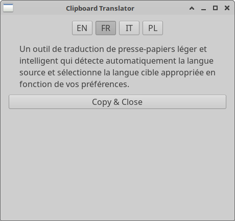

# Clipboard Translator

[](https://github.com/triklozoid/translator/actions/workflows/ci.yml)
[](https://codecov.io/gh/triklozoid/translator)



A lightweight, intelligent clipboard translation tool that automatically detects the source language and selects the appropriate target language based on your preferences.

## Features

- **Automatic Language Detection**: Uses the [lingua](https://github.com/pemistahl/lingua-rs) library to detect the source language of clipboard text
- **Smart Language Selection**: Intelligently chooses the target language based on your primary and secondary language preferences
- **Streaming Translation**: Results appear incrementally as the LLM generates them, so you see output immediately
- **Automatic Retry**: Transient errors (5xx, network, rate-limit, timeout) are retried up to 3 times with exponential backoff (1s → 2s → 4s, capped at 8s)
- **Cancellation Support**: Switching languages mid-translation cancels the previous request automatically
- **Single Instance**: Only one instance of the app can run at a time, preventing duplicate windows
- **Multi-Provider Support**: Works with any OpenAI-compatible API — auto-detects the provider from the API URL
- **Configurable**: Easily customize your language preferences and translation service settings
- **One-Click Copy & Close**: Translate and copy with minimal interruption to your workflow
- **Translation Logging**: When debug mode is enabled, all translations are logged to a local file

## Supported Providers

The application auto-detects which provider you're using based on the `api_url` in your config and expects the corresponding environment variable:

| Provider URL contains | Environment Variable       |
|-----------------------|----------------------------|
| `api.moonshot.ai`     | `MOONSHOT_API_KEY`         |
| `ollama.com`          | `OLLAMA_API_KEY`           |
| `api.deepseek.com`    | `DEEPSEEK_API_KEY`         |
| `api.openai.com`      | `OPENAI_API_KEY`           |
| Other (OpenRouter, custom) | `OPENROUTER_API_KEY`  |

## How It Works

The application uses a smart algorithm to determine the target language:

```
// Variables:
// PRIMARY_LANGUAGE   — user's primary language
// SECONDARY_LANGUAGE — second language (most common translation from PRIMARY_LANGUAGE)
// LAST_LANGUAGE      — last selected target language (or null)
// SRC                — language of the source text

function chooseTargetLanguage(SRC, PRIMARY_LANGUAGE, SECONDARY_LANGUAGE, LAST_LANGUAGE):
    // 1. If the source isn't the primary language, translate into the primary language
    if SRC ≠ PRIMARY_LANGUAGE:
        return PRIMARY_LANGUAGE

    // 2. If the source is the primary language and there's a meaningful last choice, use it
    if LAST_LANGUAGE ≠ null AND LAST_LANGUAGE ≠ PRIMARY_LANGUAGE:
        return LAST_LANGUAGE

    // 3. Otherwise, fall back to the secondary language
    return SECONDARY_LANGUAGE
```

## Installation

### Prerequisites

- Rust and Cargo (stable, edition 2021)
- GTK4 development libraries

### Building from Source

1. Clone the repository:
   ```bash
   git clone https://github.com/triklozoid/translator.git
   cd translator
   ```

2. Build the application:
   ```bash
   cargo build --release
   ```

3. Set up your API key (choose the variable that matches your provider):
   ```bash
   # For OpenRouter (default):
   export OPENROUTER_API_KEY=your_api_key_here

   # For OpenAI:
   export OPENAI_API_KEY=your_api_key_here
   ```

## Configuration

The application creates a configuration file at `~/.config/translator/config.toml` with the following settings:

```toml
api_url = "https://openrouter.ai/api/v1"
model_version = "openai/gpt-4o"
primary_language = "EN"
secondary_language = "FR"
all_target_languages = ["EN", "FR", "IT", "PL"]
debug = false
```

- `primary_language`: Your main language — ISO 639-1 code (default: `EN`)
- `secondary_language`: Your second most used language (default: `FR`)
- `all_target_languages`: List of languages available as buttons in the UI
- `api_url`: API endpoint for translations — determines which env var is used for auth
- `model_version`: AI model to use for translations (default: `openai/gpt-4o`)
- `debug`: When `true`, logs translation prompts and responses to a file

## Usage

1. Copy text in any language to your clipboard
2. Run the application:
   ```bash
   ./run
   ```
   Or with debug logging enabled:
   ```bash
   cargo run -- --debug
   ```
3. The application will automatically detect the source language and translate to the appropriate target language
4. Click on any language button to translate to that specific language (previous translation is cancelled automatically)
5. Click "Copy & Close" to copy the translation to your clipboard and close the application
6. Click "Close" to close without copying

## License

[MIT License](LICENSE)

## Contributing

Contributions are welcome! Please feel free to submit a Pull Request.
